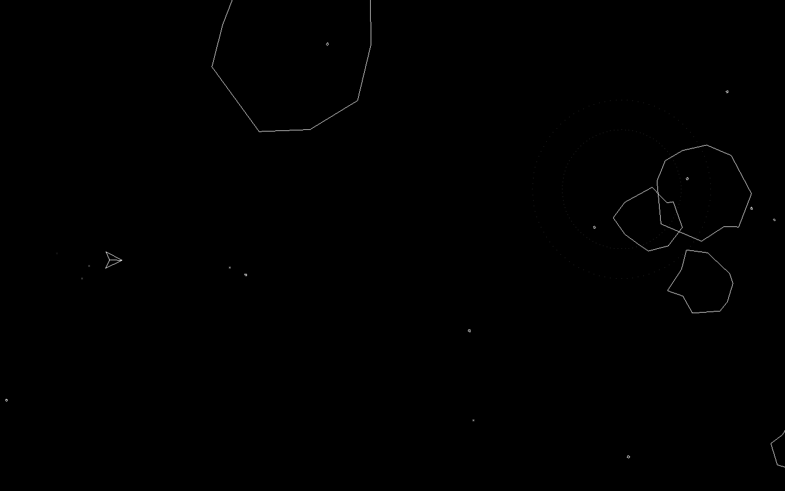
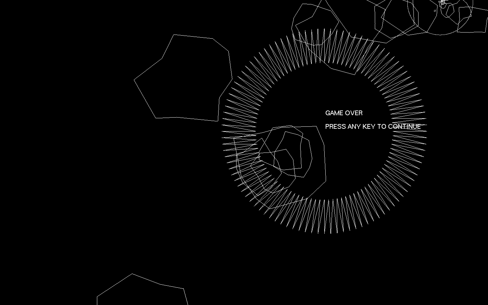
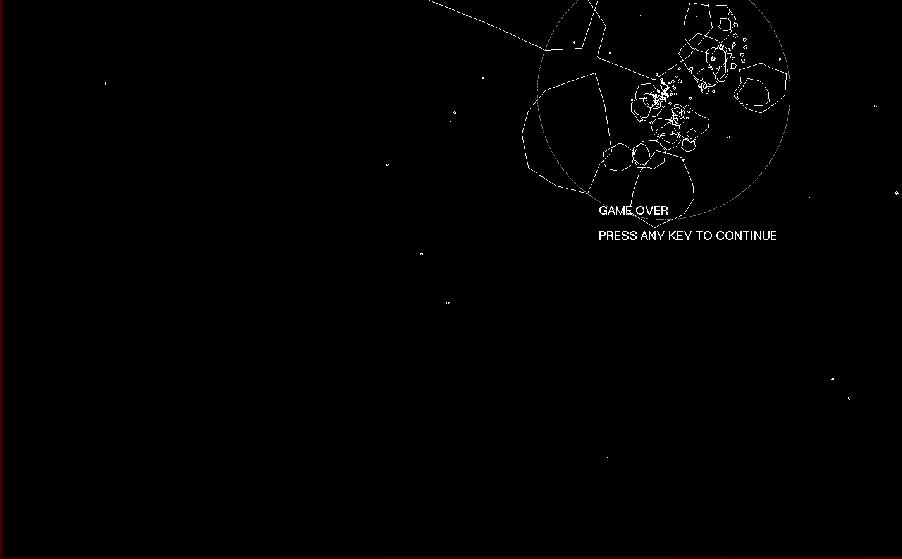

# Asteroids

A classic Asteroids clone built in C using OpenGL and GLUT. Features a ship with inertia-based movement, splitting asteroids, a gravitational black hole, and particle effects.

---

## Project Structure

- Visual Studio solution is in the vs folder
- External libraries needed to compile OpenGL programs using Visual Studio are in libs
- Compiled executables are placed in the root folder
- Don't delete freeglut.dll, it's needed
- Compile 64 bit versions only, as freeglut.dll is a 64 bit dll

---

## Building

### Windows (Visual Studio)

Open the .sln file in the vs folder and build in x64 mode.

### macOS

Visual Studio is not available on macOS. Use the terminal to compile.

Install freeglut via Homebrew:
brew install freeglut

Compile from the project root directory:
gcc src/main.c -framework OpenGL -framework GLUT -o asteroids

Run with:
./asteroids

### macOS (Debug / Memory Check)

To build with AddressSanitizer to detect memory issues:
gcc src/main.c -framework OpenGL -framework GLUT -o asteroids -fsanitize=address -g

---

## Controls

- W - thrust forward
- A - rotate left
- D - rotate right
- Left click - shoot
- Q / ESC - quit

---

## Screenshots

*Game over*

*Black hole*

---

## Known Issues

- Score display only shows the last digit
- Screen resolution is hardcoded to 2560x1440 - change SCREEN_WIDTH and SCREEN_HEIGHT in main.c to match your display
